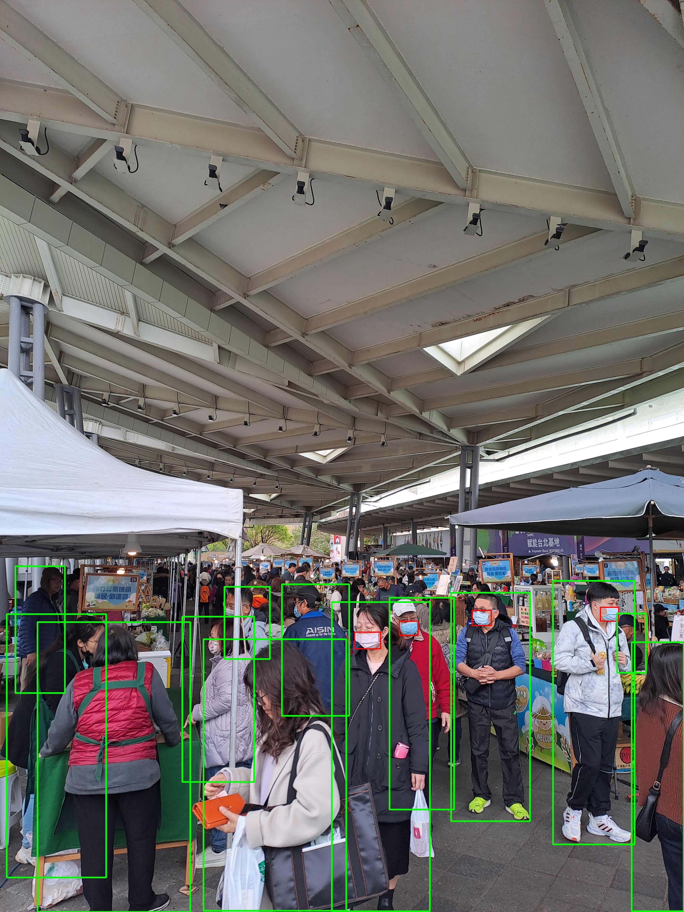

# mask-detect

Detect whether the people wear masks.

<p align="center">
  
</p>

## Usage

### Environment setup

1. Install [Python](https://www.python.org/) and [uv](https://docs.astral.sh/uv/getting-started/installation/).

2. Install dependencies.

    ```sh
    uv sync
    ```

### Detect

Use [src/detect.ipynb](src/detect.ipynb) to detect the people in the picture and the masks.

### Train model with custom dataset

Follow the instructions in [src/train.ipynb](src/train.ipynb). A label-modification utility is also provided as [src/train_utility.ipynb](src/train_utility.ipynb).
